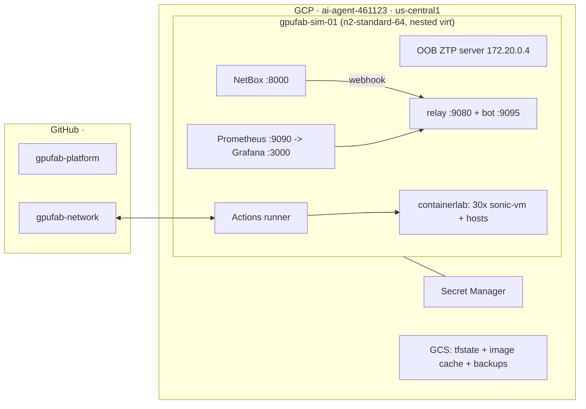

# GPU-Fabric Simulation Platform — Design

**The substrate that exercises the [Network Fabric Automation](network-automation-design.md) design without hardware.**

This document is the **simulation platform** only. It emulates the DGX B300 / SONiC fabric on a single GCP VM so that the automation — NetBox as source of truth, GitOps render/deploy/drift, ZTP, telemetry, auto-remediation — can be built and operated exactly as it would be on real gear. **The automation itself is described in [Doc A](network-automation-design.md)**; read that for the five pillars (Source of Truth → Render → Provision → Observe → Remediate), the addressing/ASN plan, the NetBox data model, the GitOps pipeline, and the physical-hardware bootstrap. This doc covers only what is *different because it is simulated*: how the substrate is built, its fidelity limits, and the substrate-specific findings.

> **Why a sim at all.** Building pillars ①–⑤ against a faithful software substrate hardens them so the physical bring-up is a bootstrap, not a bespoke project (Doc A §10). The sim also becomes a partner-facing demo (§10 here) and a safe place to run chaos drills.

---

## 1. Fidelity contract & how the sim maps to the automation

### 1.1 What is real vs. simulated

| Faithfully exercised (the point of the sim) | Simulated / stood-in (stated loudly) |
|---|---|
| ZTP, IaC/GitOps, config management, drift/remediation | **ASIC dataplane** — no PFC/ECN/QoS/RoCE *behavior* (QoS config is still rendered & validated, just inert) |
| Full **BGP control plane** (eBGP, ECMP, rail-optimized leaf-spine, BGP-to-the-host) | Counter rates unrealistic; congestion panels can't be truthful (labelled "sim-limited") |
| SONiC NOS config surface (`config_db`, FRR, AAA, LLDP) | No CUDA/GPU compute — Slurm places `gpu:8` GRES but jobs can't run CUDA |
| Telemetry pipeline, dashboards, alerting, closed-loop remediation | No kernel Lustre/LNet/RDMA — DDN is ops-level (NFS stand-in + synthesized EXAScaler metrics) |

**Honesty rule:** anything not real is named as such, here and in the risk table (§12). The automation and operations are real; the silicon and the science are not.

### 1.2 Mapping — Doc A pillar → sim implementation

| Doc A pillar | Sim implementation | Fidelity |
|---|---|---|
| ① Source of Truth (NetBox) | **identical** — netbox-docker on the sim host | real |
| ② Render (SoT → config) | **identical** — `render.py`/`render_fabric_ztp.py` | real |
| ② GitOps (render/validate/deploy/drift + relay + runner) | **identical** — self-hosted runner on the sim host | real (loop verified live) |
| ③ Provision (ZTP) | DHCP+opt67 over a Linux bridge; **MAC-pin stand-in** for serial/Option-82; **config-push backfill** for a substrate race (§6) | flow real, identity + reliability substrate-specific |
| ④ Observe (gNMI→Prom→Grafana) | **identical**, plus an SSH-poll fallback exporter | real |
| ⑤ Remediate (bot + guardrails) | **identical** | real |
| Switches | vrnetlab/QEMU SONiC-VS VMs in containers (§3–4) | control-plane real, dataplane generic SAI |
| Cabling | containerlab-generated veths from NetBox Cables | real topology, virtual links |

### 1.3 Profiles — a parameterized model

Scale is *data*, not a fixed shape: `full` (4 DGX, 8 rails × 2 planes, 30 switches), `lite` (17 switches, the daily-dev vehicle), `minimal` (10). One flag switches between them because every value is formula-derived (Doc A §4, `gpufab validate/estimate`, §8 here).

---

## 2. Simulation platform on GCP

### 2.1 Layout

### 2.2 Terraform (`gpufab-platform/terraform/`)

| Resource | Spec |
|---|---|
| State | GCS bucket `gpufab-tfstate` |
| VPC / subnet | `gpufab-vpc`, `10.10.0.0/24`, us-central1 (outside all sim ranges) |
| Firewall | key-only SSH (internet-open, gated by SSH key + fail2ban) or IAP-only; no other public ingress |
| VM | `gpufab-sim-01`: machine type from the **estimator** (`n2-standard-64` for `full`), `enable_nested_virtualization = true`, pd-ssd, Ubuntu 24.04, static IP |
| Service account | **attached** (`cloud-platform`), so the VM reaches GCS (image cache) + Secret Manager via the metadata SA — no keys on disk. Defaulted in `var.service_account` |
| Secrets (Secret Manager) | `gh-pat-relay`, `netbox-webhook-secret`, `netbox-api-token-ci`, `grafana-admin` |

### 2.3 Sizing & cost — estimator-generated (approximate)

| Profile | Switch VMs | RAM +headroom | Estimator pick | On-demand | Spot |
|---|---|---|---|---|---|
| full | 30 | 181 GB | n2-standard-64 (256 GB) | ~$3/hr | ~$0.9/hr |
| lite | 17 | 111 GB | n2-standard-32 | $1.55/hr | $0.54/hr |

Operating rule: **`gpufab pause` when idle** (a stop/start survives; the fabric redeploys via `deploy.sh --reboot`, §9). Spot is acceptable for dev (full rebuild from git is a tested path).

### 2.4 Host bootstrap (Ansible, `gpufab-platform/ansible/`)

Docker + compose, containerlab (0.77), qemu-kvm, python venv (pynetbox/jinja2), sysctl tuning (inotify, ARP GC, rmem), the self-hosted **Actions runner** (label `sim-host`, systemd), and the service compose stacks. Gate: `kvm-ok` passes; a hello-world clab topology deploys.

---

## 3. Node & image strategy

| Node class | Image | Resources | Count (full) |
|---|---|---|---|
| Switch | `vrnetlab/sonic_sonic-vs:<ver>` — [hellt/vrnetlab](https://github.com/hellt/vrnetlab) around `sonic-vs.img` | 2 vCPU / 4 GB QEMU VM in a container | 30 |
| DGX / DDN host | `gpufab-host:1.0` — FRR + iperf3/fio/lldpd/slurmd/NFS on `frrouting/frr` | 2 GB | 6 |
| Slurm head | `gpufab-head:1.0` — slurmctld + munge + slurm-exporter | 1 GB | 1 |

- **The ZTP-enabled image is a source build.** The community `sonic-vs` image ships **no ZTP service**; true ZTP needs an `ENABLE_ZTP=y` build of `sonic-buildimage` (202505, bookworm slave), wrapped by vrnetlab → tag `…:202505-ztp`. The recipe is captured in `images/build_ztp_image.sh` and the built ~1.9 GB image is **cached in GCS** (`image_cache.sh`) so a fresh host loads it in ~1 min instead of the multi-hour rebuild.
- **Boot behavior:** a sonic-vm takes 5–10 min to first prompt; bring-up is **staged** (containerlab deploy in groups, RAM watch).
- **Custom VS HWSKUs (checkpoint C3):** each switch model (Doc A §2.4) needs a vs-platform HWSKU so port naming/speeds match; fallback `generic-vs-32` keeps model identity in NetBox only.
- Host containers run FRR with one veth per simulated NIC port; **PID 1 is `sleep infinity`** so a crashing init never recycles the netns and kill the veths.

---

## 4. Topology generation (NetBox → containerlab)

`gen_topology.py` reads NetBox (devices → clab kind via `node_class`; primary IPs → `mgmt-ipv4`; **Cables → one veth per link**) and emits `gpufab.clab.yml`. Interface mapping is positional and model-driven: a switch's NetBox port name maps to `eth{index+1}` via the device's platform model (Doc A §2.4). Hosts keep their NetBox interface names verbatim (renamed inside the container at start).

- **Mgmt bridge:** the containerlab management network (`gpufab-oob`, `172.20.0.0/24`) *is* the OOB network — see §6.1 for why this hybrid is the honest sim design.
- **Deterministic mgmt MACs:** each `sonic-vm` node gets `CLAB_MGMT_MAC = 02:00:<mgmt-ip-octets>`, matching `render_fabric_ztp.mac_for()` — so DHCP reservations are pre-rendered with **no harvest** (the sim's stand-in for real serial/Option-82 identity).
- **Staged deploy:** destroy-then-deploy forces fresh QEMU (clears any wedged mgmt) on every node; wait for `healthy` then a real config-DB read before proceeding (guards the ~66 s false-healthy window).

---

## 5. Access, portal & console (sim)

Three access tiers, each with its own credential — mirroring how a real deployment separates the cloud boundary, the operator UIs, and per-device NOS login:

1. **GCP boundary.** SSH gated by key (+ fail2ban) from a static IP, or IAP-only; host login keys live in **GCP instance metadata** (added/revoked without logging into the VM). All UIs reached over one tunnel or the console.
2. **Landing console** (`:8080`/`:8088`, nginx): live fabric status, links to every UI (`/grafana/`, `/prometheus/`, `/topology/`), the build-phase table, and a **per-switch admin-login action**.
3. **Per-NOS login.** Each switch runs SONiC AAA (TACACS+ on the OOB net + local fallback). A portal **web terminal (ttyd, `/terminal/`)** SSHes into any switch's real CLI (pw-probe: rotated secret → factory `admin`, so it works in either auth state); or `ssh admin@<mgmt-ip>` directly. Automation uses a dedicated `gpufab-automation` keypair; the factory password rotates on a full deploy. ~~Hand edits are still caught by drift-check — interactive access never bypasses the SoT.~~ **Not true as of 2026-07-29: nothing catches hand edits.** `drift-check.yml` was deleted (#91/#98) having never once succeeded in 24 runs, and it had no revert path even in design; `tools/drift.py` survives but has no caller. Interactive access **does** currently bypass the SoT undetected. See `network-automation-design.md` §6 and `gpufab-network/.github/workflows/README.md`.

---

## 6. Sim ZTP realities

Doc A §7 describes ZTP on real hardware (DHCP + serial/Option-82 reservations + opt67). The sim runs the **same flow** but hits substrate-specific issues that have no analog on metal.

### 6.1 Why OOB = the containerlab management bridge

SONiC's `eth0` lands wherever containerlab puts management, so the honest design makes the clab mgmt bridge *be* the OOB network (`172.20.0.0/24`), with the OOB ZTP server the **only DHCP speaker** on it (Docker assigns service-container IPs statically, so no conflict). The `oob-sw` VMs are real topology members; switch `eth0` plumbing rides the bridge. A stated simplification.

### 6.2 The management-path saga (checkpoint C1)

- **vrnetlab NATs mgmt via QEMU slirp** by default — the VM sees `10.0.0.15/24`, not a bridge address, and slirp's conn table **wedges** under per-poll SSH churn. Fixed by **`CLAB_MGMT_PASSTHROUGH`** (bridged tap) + **persistent multiplexed SSH** (`ControlPersist`, one connection per switch) everywhere in the tooling.
- The community image has **no ZTP**, so until the `ENABLE_ZTP=y` build landed, config was applied by the interim `config_db` push (`interim_deploy.py`), which fully converges the fabric.

### 6.3 ZTP reliability at scale — the passthrough race + config-push backfill

Once the ZTP image + bridged mgmt landed, self-provisioning works but is **timing-sensitive at cold-boot scale**:

- **Root cause.** **containerlab 0.77 consumes `CLAB_MGMT_PASSTHROUGH` and does not inject it into the container** (only `CLAB_MGMT_MAC` reaches the VM env). vrnetlab therefore reads passthrough=false and **static-seeds the mgmt IP** (`ip address add 172.20.0.NN/24` from `mgmt-ipv4`); SONiC's ZTP DHCP client must then *win a race* against that static assignment. At 30 simultaneous cold boots most switches lose it (one run: 4/30 self-provisioned).
- **Why dropping `mgmt-ipv4` doesn't help.** Passthrough being stripped, containerlab just auto-assigns a *pool* IP that vrnetlab static-seeds anyway — non-deterministic and breaking the address plan. The real fix needs passthrough honored (a containerlab-version detail requiring its own validated test).
- **The shipped fix — ZTP-first, config-push backfill** (`50-ztp-provision.sh`): give ZTP a bounded window, then push the same NetBox-rendered config to any switch that didn't self-provision (idempotent for those that did). Every switch has a reachable static mgmt IP, so the fabric fully converges on every run. This is the production ZTP-plus-finisher pattern, sim-flavored. **Verified: 30 switches, 148/148 host BGP.** On real hardware this backfill is unnecessary (blank switches DHCP cleanly — Doc A §7.2).

---

## 7. Compute stack emulation: Slurm & DDN

### 7.1 Topology additions

- **`head01`** (`gpufab-head:1.0`): slurmctld + munge + login. On the frontend VLAN 100 + OOB.
- **slurmd on every DGX**, munge-authenticated; GRES `gpu:8` with `Count=8` and no device files — the scheduler places jobs as if 8 GPUs existed; jobs can't run CUDA (§1.1).
- **DDN `ddn01`** = controllers `ddn01a/b`, each dual-homed `st0/st1` → st-leafs with eBGP, exactly like DGX storage ports.

### 7.2 Slurm design

- **Config is GitOps like everything else**: `slurm.conf.j2`/`gres.conf.j2`/`topology.conf.j2` rendered from NetBox, deployed by `deploy.yml` (`scontrol reconfigure`).
- **`topology.conf` is generated from NetBox cables** — the scheduler is rail/plane-aware the way a real SuperPOD is; cabling changes propagate to placement via a PR.
- **Job library**: `railstorm.sbatch` (iperf3 mesh across all rails — NCCL-allreduce stand-in), `storagestorm.sbatch` (fio to `/lustre`). A cron submits these so **the Grafana traffic is scheduler-driven**, never flat.

### 7.3 DDN EXAScaler simulation (ops-level)

- **Filesystem:** NFS export from the active controller, mounted `/lustre` on all DGX + head (name kept for realism), over the storage fabric.
- **Service VIP `10.255.2.100/32`:** BGP-advertised by the active controller only (health-checked FRR route injection); standby takes over on failure. Emulates EXAScaler multi-rail service reachability with the same routing machinery as the rest of the sim.
- **Telemetry:** `ddn-exporter` publishes EXAScaler-style metrics (capacity, OST/MDT-labeled throughput/IOPS from the NFS server's /proc counters) → dashboard 5.
- **Honesty rule:** no kernel Lustre/LNet/RDMA (shared-kernel containers can't run them). The *network, routing, failover, and operational telemetry* of storage are simulated; the filesystem protocol is a stand-in.
- **Drill 5 — controller failover:** stop `ddn01a` → VIP withdrawn → `ddn01b` advertises → NFS recovers; dashboard 5 shows the VIP flip; the bot files an *escalate-only* informational issue (failover is designed behavior, not drift).

---

## 8. Customization, scaling & the `gpufab` CLI

`gpufab.py` (`validate` / `topology` / `estimate` + lifecycle). Profile schema (§1.3) drives everything; unset keys inherit defaults.

- **`gpufab validate`** enforces bounds and **derived capacity limits** — /24 exhaustion for host p2p (`rails × dgx × 2 ≤ 254`), per-role port budgets, OOB block collisions — and warns on degraded-but-legal shapes. The Doc A §4 addressing formulas are implemented **once**, here; `seed.py` and `gen_topology.py` consume this derivation, so doc/NetBox/sim can never disagree.
- **`gpufab estimate`** derives RAM/vCPU/disk/boot-groups from the topology and recommends the cheapest GCP machine from `gcp_catalog.yaml` (data, not code), with on-demand/spot costs. Terraform reads the pick.
- **`gpufab up`** runs the lifecycle (infra → bootstrap → images → services → seed → topology → ztp → validate → workload), idempotent + resumable, recorded in `.gpufab/state.json`; `pause`/`resume`/`down`/`destroy` are tiered teardown.
- **Switch model catalog** (`switch_catalog.yaml`): per-model port groups + NetBox device type + VS HWSKU; adding a vendor = one catalog entry + a device-type YAML + (C3) a HWSKU.
- **Scaling ceilings** trace to real limits: rails ≤ 8 / planes ≤ 2 (B300 NIC model), dgx ≤ 9 (OOB block + ASN scheme); the practical single-host ceiling is RAM (~90 switch VMs at 4 GB on a 512 GB host). Beyond that: lower `ram_gb`, or split planes across hosts (out of scope for v1).

---

## 9. Sim-as-a-Service & operational hardening

### 9.1 Multi-instance for partners

The goal: independent fabric instances on demand so partners can operate a running GPU-cloud network without touching production. Each instance is a pure function of two inputs — an **instance name** and a **profile** — so "another sim" is a repeatable, reviewed operation.

- **Isolation:** one GCP VM per instance (17–36 nested VMs, 60–160 GB), its own VPC with no peering; own NetBox/telemetry/portal.
- **Single audited entry point:** `deploy.sh` (defaults `USE_ZTP=1`) runs every stage — `00-bootstrap … 40-topology → 50-ztp-provision → 60-auth → 70-telemetry → 80-portal → 85-console → 90-automation`. The former standalone `ztp-deploy.sh` is now a thin wrapper over it, so the two can't drift. Provisioning is a pure function of `PROFILE` + `USE_ZTP`.
- **Guardrails:** partners get portal + NOS-operator credentials, not GCP/host access; `pause` for cost control; `deploy.sh --recover` returns an instance to green between demos.
- **Remaining for v1 SaaS:** parameterize Terraform per-instance (workspace/name/VPC), a small control-plane CLI/registry (`gpufab provision/list/pause/destroy <name>`), and a per-instance auth-proxy for portal access.

### 9.2 Operational hardening & reboot recovery

A GCP **stop/start** (needed once to attach the service account) exposed cold-boot fragilities. All are handled by committed scripts — reproducible, not hand-fixed — and recovered with **one command: `deploy.sh --reboot`**.

| Symptom on cold boot | Root cause | Folded fix |
|---|---|---|
| Fabric + NetBox down; few containers back | containerlab/compose containers carry **no restart policy** (deliberate — a crashing init would kill veths) | `deploy.sh --reboot` brings services back + rebuilds the fabric + re-runs everything |
| Webhooks silently never fire | NetBox **queue-redis** crash-loops on a corrupt AOF after the unclean stop → takes down the RQ worker (no durable data lost — that's in postgres) | `setup_netbox.sh` clears the AOF + restarts redis + worker |
| Relay starts `token=MISSING` | secrets **dir was 700 root** (service user couldn't traverse); a `gcloud secrets | tee` fallback **truncated** the token before gcloud failed | `setup_automation.sh` makes the dir group-traversable, owns secrets to the service user, fetches the SM token into a variable (writes only when non-empty) |
| ZTP self-provisions only a few switches | the passthrough race (§6.3) | `50-ztp-provision.sh` config-push backfill |
| GCS unreachable from the VM | no service account at create time | SA attached + folded into Terraform (§2.2) |

**Verified:** a full stop → start → `deploy.sh --reboot` cleanly restored **148/148 host BGP**, 30/30 switches, NetBox+worker+redis (AOF self-heal), and relay+bot — in ~29 min, one command.

**Reboot fast path** (applying Doc A's efficiency invariants): `--reboot` defaults to **config-push** (`USE_ZTP=0`) instead of waiting out the ~7.5 min ZTP DHCP window — on a reboot every switch is a known, reachable node, so ZTP-from-blank buys nothing (it reuses the `-ztp` image already on disk). And **auth is a single pass**: `setup_auth.sh` generates the secrets + TACACS server *before* the config push (so `config_db` carries AAA), and `interim_deploy` installs the automation key + rotates the admin password *inside* its parallel per-switch pass — no separate serial sweep (stage 60 is now a near-no-op). Together these cut a reboot to **~20 min**, most of it the unavoidable 30-VM boot. On real hardware neither is needed: blank switches DHCP cleanly (no backfill), and the rendered config carries AAA from the start (Doc A §5).

---

## 10. Fidelity limits, risks & gaps

| # | Gap | Disposition |
|---|---|---|
| R1 | Software dataplane: no PFC/ECN/QoS/RoCE behavior | **Accept & state loudly**; QoS config still rendered/validated (hardware-ready) |
| R2 | Counter rates unrealistic | **Accept + calibrate** dashboards; label "sim-limited" |
| R3 | EVPN/VXLAN fragile on VS | **Designed out** — pure L3 + plain VLAN frontend |
| R4 | No MCLAG → frontend single-active gateway | **Accept + document**; host active-backup bonds |
| R5 | vrnetlab mgmt path (slirp/passthrough) | **Resolved** — `CLAB_MGMT_PASSTHROUGH` + ControlPersist SSH (§6.2) |
| R6 | ZTP cold-boot race at scale | **Resolved for correctness** — config-push backfill (§6.3); no analog on real HW |
| R7 | 30 QEMU VMs: ~180 GB peak, 5–10 min boots | n2-standard-64 + staged deploy + `lite` for daily dev |
| R8 | Single-VM blast radius | Nightly NetBox dump → GCS; everything rebuilds from git; `deploy.sh --reboot` is a tested path |
| R9 | No kernel Lustre/RDMA; Slurm GPUs declared not real | **Accept & state loudly** (§7.3); real EXAScaler/NCCL integration points documented for hardware |
| R10 | Switch ASIC identity is inventory-deep only (generic virtual SAI) | **Accept + checkpoint C3**; `generic-vs-32` fallback |

---

## 11. Live build status (as of 2026-07-24)

Executed against the real `gpufab-sim-01`, **`gpu64` profile (8 DGX, 64 GPU, 30 switches)**, via the audited `deploy/` stages. Host `/opt/gpufab` is a clean git checkout at HEAD.

| Area | State |
|---|---|
| P0 GCP foundation | **done** — VPC, key-only SSH + fail2ban, static IP, nested-virt VM, **SA attached** |
| P1 images | **done** — sonic-vs 202505 + `ENABLE_ZTP=y` build (`…:202505-ztp`); recipe committed + image cached in GCS |
| P2 NetBox + seed | **done** — **NetBox is the active SoT for config** (render + gen_topology read NetBox, not the profile) |
| P3 topology + bring-up | **done** — 30 switch VMs + hosts from NetBox, pinned mgmt MACs |
| P5 ZTP + backfill | **done** — ZTP-first + config-push backfill; **148/148 host BGP**, 8-way rail ECMP |
| provisioning model | **folded** — single entry point `deploy.sh` (USE_ZTP default); `ztp-deploy.sh` collapsed to a wrapper |
| access/auth | **done** — console :8080/:8088, per-NOS web terminal (pw-fallback), TACACS+ available |
| P7 telemetry | **done** — exporter → Prometheus → Grafana; 28 switches + 148 host BGP tracked |
| **P6 GitOps** | **loop live end-to-end** — a NetBox-only edit auto-produces a reviewable PR (verified: PR #3 from a lone `bgp_asn` change): NetBox → webhook → relay → `repository_dispatch` → `render` → `render.py` (real) → auto-opened PR. Relay + bot run from stage 90. Remaining: `deploy.yml` apply-on-merge. ~~+ `drift-check` to green~~ — **`drift-check.yml` was deleted 2026-07-29 (#91/#98), never having succeeded in 24 runs; it will not go green.** Its duty becomes the reconciler's `--plan` on a schedule |
| reboot recovery | **folded** — `deploy.sh --reboot` + AOF self-heal + ZTP backfill (§9.2) |
| P4 render / P8 remediation drills / P9 Slurm+DDN / P11 SaaS | pending |

---

## 12. Appendices

### A. Service port map (sim host)

| Service | Port | | Service | Port |
|---|---|---|---|---|
| **Console (start here)** | **8080 / 8088** | | webhook relay | 9080 |
| NetBox | 8000 | | remediation bot | 9095 |
| Grafana | 3000 (`/grafana/`) | | node-exporter | 9100 |
| Prometheus | 9090 (`/prometheus/`) | | **gpufab exporter** | **9101** |
| OOB ZTP server | 172.20.0.4 | | **NOS web terminal (ttyd)** | **7681 (`/terminal/`)** |
| Topology graph (clab) | `/topology/` | | TACACS+ (OOB) | 49 |

### B. Interface maps

Deterministic, generator-enforced from the switch model (Doc A §2.4). Example (SN5600 rail leaf): `Ethernet0/8/16/24` = dgx01–04, `Ethernet32/40` = spine uplinks; vrnetlab positional mapping `Ethernet{first_lane + idx·lanes_per_port}` → `eth{idx+1}`.

### C. 20-minute demo storyline

Console health → NetBox topology → make a NetBox change, watch the **auto-PR** open (P6 loop) → merge & watch deploy → per-rail throughput under a `railstorm` job → inject BGP drift, watch the bot revert it (drill 1) → DDN controller failover (drill 5).

### D. Decision records (sim-specific)

- **All-VM SONiC** (not a simulated-ZTP agent) — every switch is a full SONiC VM so ZTP/AAA/config are real.
- **containerlab + vrnetlab** (not docker `sonic-vs`) — needed for a bootable NOS with a real control plane.
- **One VM per sim instance** (not shared) — hard blast-radius isolation + per-instance lifecycle/cost.
- **Config-push backfill kept** even after ZTP works — deterministic convergence at cold-boot scale; a sim artifact, removed on real hardware.

### E. See also

- **[Network Fabric Automation — Design & Bootstrap](network-automation-design.md)** — the automation this substrate exercises, and how to bootstrap it on physical hardware.
