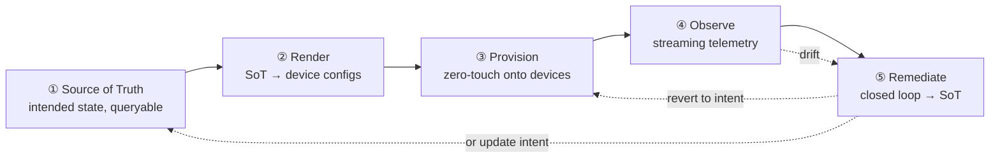

# Network Fabric Automation — Design & Bootstrap

**A concrete design for a NVIDIA DGX B300 / SONiC GPU-cloud fabric, written as a generic infrastructure-automation blueprint.**

The concrete stack (community SONiC on a DGX B300 pod) is the *worked example* throughout. But every building block is presented **generic-principle-first, reference-instantiation-second**, so the same design bootstraps a different fabric — another NOS, another vendor, a non-GPU network — by swapping the reference fill-ins. This document is deployment-substrate-agnostic: it applies equally to **physical hardware** and to the [simulation platform](gpufab-sim-design.md) that exercises it without hardware. Where a detail is true only of physical gear or only of the sim, it says so.

> **How the two docs relate.** *This* doc is the automation. The [GPU-Fabric Simulation Platform](gpufab-sim-design.md) doc is one *substrate* it runs on (containerlab/vrnetlab/QEMU on GCP); a rack of real switches is another. Read this to understand what is being automated and how; read the sim doc only for how the substrate is emulated.

---

## 0. The generic pattern — what "comes down to generic infra"

Strip away GPUs, SONiC, and NVIDIA and five pillars remain. Every fabric-automation system is some instantiation of them:



| Pillar | Generic mechanism | This fabric's instantiation | Swap point (to generalize) |
|---|---|---|---|
| **① Source of Truth** | one API-queryable store of *intended* state (inventory + topology + addressing) | NetBox (DCIM + IPAM) | any DCIM/IPAM with an API and webhooks |
| **② Render** | deterministic function: SoT → per-device config artifacts, committed to git | `render.py`/`render_fabric_ztp.py` → `config_db.json` | a per-NOS render adapter (FRR, IOS-XR, EOS, Junos…) |
| **③ Provision** | zero-touch: identity → address → config, no hands on the box | DHCP + reservation + opt67 → SONiC ZTP | any ZTP/PXE/POAP flow; opt66/67/150 |
| **④ Observe** | streaming telemetry → TSDB → dashboards → alerts | gNMI → Prometheus → Grafana → Alertmanager | any streaming/scrape source into a TSDB |
| **⑤ Remediate** | alert → guarded actuator → revert-to-intent, audited | FastAPI bot → re-apply rendered config | any runbook engine with guardrails |

Two invariants hold regardless of instantiation, and they are the spine of everything below:

1. **The SoT is authoritative; a device is a projection of it.** Nothing is hand-authored on a box; drift is detected and reverted.
2. **Change flows one way through a control loop:** intent lands in the SoT → is rendered → is reviewed (PR) → is applied → is verified. Git is both the *input* (design-as-code that seeds the SoT) and the *output* (rendered configs that get deployed and diffed).

Everything else in this doc is these five pillars, made concrete.

---

## 1. Scope & operating model

**What is automated:** the full lifecycle of a GPU-cloud network fabric — bring-up (ZTP), configuration (IaC/GitOps), observability (telemetry/visualization), and closed-loop operations (auto-remediation) — across four fabrics: OOB management, compute frontend, compute backend (dual-plane, multi-rail), and storage backend.

**Operating principle:** source-of-truth-driven, GitOps-mediated, zero-touch, closed-loop. An operator never SSHes to a switch to make a lasting change; they change the SoT (directly, or via design-as-code in git), and the loop renders → reviews → applies → verifies.

**Generic reading:** the five-pillar control-loop pattern is substrate-neutral. GPU-specific details are concentrated in §2 and in the data/render adapters used by pillars ①–②; the mechanisms in pillars ③–⑤ generalize unchanged — they would automate a storage fabric or a campus spine-leaf as-is.

---

## 2. The target fabric (concrete)

> **Generalization note.** The automation cares about *roles, ports, cabling, and addressing* — not GPUs. Replace the DGX host model and rail-optimization with any endpoint/leaf mapping and the rest of the design is unchanged.

### 2.1 Endpoint (DGX B300) network model

| Interface(s) | Real-world analog | Fabric | Count |
|---|---|---|---|
| `rail{1..8}p{1,2}` | 8× ConnectX-8 SuperNIC, dual 400G — port 1→plane 1, port 2→plane 2 | Compute backend | 16 |
| `fe0`, `fe1` | 2× BlueField-3 DPU (400G) | Compute frontend | 2 |
| `st0`, `st1` | 2× storage-facing DPU ports | Storage backend | 2 |
| `bmc0` | BMC 1G | OOB | 1 |

Storage is a DDN EXAScaler-style appliance `ddn01` (two controllers `ddn01a/b`); a Slurm head `head01` attaches to the frontend + OOB.

### 2.2 The four fabrics

- **Compute backend — dual-plane, multi-rail (the centerpiece).** Rail-optimized: rail *R* of every endpoint lands on the same leaf (`bk-pP-rR-leaf01`), so intra-rail GPU↔GPU traffic never crosses a spine. Two independent planes (P1/P2) give redundancy + multipathing; each NIC contributes one port per plane. **Pure L3: /31 links + eBGP + ECMP end-to-end, BGP on the endpoints themselves (FRR)** — 16 sessions per endpoint. This "BGP-to-the-host" pattern is the modern GPU-fabric norm and is what makes the automation NOS-symmetric (the same render logic emits FRR for hosts and config_db for switches).
- **Compute frontend.** North-south. 2 leaf + 2 spine; endpoint `fe0/fe1` in active-backup bond, VLANs 100/200, single-active SVI gateway, eBGP underlay.
- **Storage backend.** East-west to DDN. Same pure-L3 pattern as backend; controllers advertise a filesystem service VIP via BGP.
- **OOB management.** `oob-sw01/02` carry BMC links; switch management (`eth0`) rides the OOB network. **This is pillar ③'s substrate** — the network ZTP and telemetry run over.

### 2.3 Inventory (full profile)

| | Switches | Host links | Inter-switch links |
|---|---|---|---|
| Backend | 16 leaf + 4 spine | 64 | 32 |
| Frontend | 2 leaf + 2 spine | 9 | 5 |
| Storage | 2 leaf + 2 spine | 12 | 4 |
| OOB | 2 | 7 BMC | 2 |
| **Total** | **30** | 92 | 43 |

≈116 eBGP sessions fabric-wide.

### 2.4 Switch platform models

Each role group maps to a **platform model** (`switch_catalog.yaml`), overridable per deployment. Default data-fabric switch: **NVIDIA SN5600 (Spectrum-4, 64×800G)**; OOB: **SN2201**. Alternatives: **Edgecore AS9817-64O (Broadcom Tomahawk-5)**, SN5400. A model controls port inventory, NOS port naming, speeds, and the device type in the SoT — it is a **swap point**: change the catalog entry, the render adapter and port maps follow.

---

## 3. Pillar ① — Source of Truth (NetBox)

> **Generic principle.** Intended state lives in exactly one API-queryable place: inventory, topology (every cable), addressing (every prefix/IP), and per-device intent (roles, ASN, flags). Everything downstream reads it; nothing downstream is a second source.

Deployment: **netbox-docker**, NetBox 4.3.x, an API token + a webhook HMAC secret.

### 3.1 Data model

| Object | Usage |
|---|---|
| Site / Location / Racks | `sim-dc1` / `hall-1`; racks per DGX + per network zone |
| Device roles | `backend-rail-leaf`, `backend-spine`, `frontend-leaf/spine`, `storage-leaf/spine`, `oob-switch`, `gpu-node`, `ddn-controller`, `head-node` |
| Device types | `nvidia/dgx-b300` (interface templates = §2.1), switch types per §2.4, `ddn/ai400x2`, `generic/slurm-head` — devicetype-library YAML |
| **Cables** | **every physical link is a Cable between exact interfaces.** The rendered topology *and* the LLDP audit both derive from Cables — topology exists in one place |
| IPAM | every §4 prefix with a role + `fabric` field; every /31 a child prefix with both IPs bound to interfaces; device primary IP = its mgmt address |
| Config contexts | weight-ordered: global (DNS/NTP/syslog) → per-role (BGP timers) → per-fabric via tags (MTU, ECMP) → per-device |

**Custom fields on Device** (the render contract): `fabric` · `plane` · `rail` · `node_class` · `ztp_mode` · `bgp_asn` (set by the seeder from policy) · a mgmt-identity field (`eth0_mac` in sim; **serial** on real hardware — see §7).

### 3.2 Seed-as-code

```
design/
  profiles/scale/s0-64.yaml   # 64 GPUs, 1 pod, 30 switches …  (scale is data, not code)
  policy/addressing.yaml   # every CIDR + allocation formula (ONE implementation)
  policy/asn.yaml          # the ASN scheme
  base/{site,device-types}/…
```

`seed.py` computes the desired object graph from profile + policy, diffs against NetBox, creates/updates (deletes only with `--prune`). **Idempotency gate: a second run reports zero changes.** It holds *no literal per-device data* — everything is formula-derived, which is what makes scale a one-flag change and makes doc/reality drift structurally impossible.

> **Swap point.** Any DCIM/IPAM with a REST API + webhooks works. The seeder and renderer talk to it through a thin client; NetBox is the reference, not a requirement.

---

## 4. Pillar ①/② — Naming, addressing & ASN plan

> **Generic principle.** Addresses are *derived from topology position by formula*, never hand-assigned. This is what makes the address itself meaningful (it encodes fabric/plane/rail/role) and makes rendering deterministic. The formulas live in `policy/addressing.yaml`; the tables below are generated documentation.

- **Hostnames:** `{fabric}[-p{plane}][-r{rail}]-{role}{NN}` — e.g. `bk-p1-r3-leaf01`, `fe-spine02`, `oob-sw01`.
- **OOB / management:** `172.20.0.0/24` — services `.1`; switches in structured blocks (`bk-p1` leafs = `.40 + rail`); DHCP pool `.200–.249` for pre-reservation boots.
- **Loopbacks:** `10.255.{1=fe,2=st,3=bk-p1,4=bk-p2,9=hosts}.0/24`; DDN service VIP `10.255.2.100/32` (BGP-advertised by the active controller).
- **Point-to-point /31s:** per-fabric /24 with a base-offset formula, e.g. `dgx↔bk-leaf pP = 10.11{3,4}.0.0/24`, base `(rail−1)·8 + (dgx−1)·2`. Convention: even = topologically higher device.
- **Frontend VLANs:** 100 (compute) / 200 (provisioning); MTU 9214 fabric, 9000 host.

**ASN scheme — eBGP everywhere, 32-bit, mnemonic `420 F P RR NNN`** (`F`: 1=fe 2=st 3=bk 9=host · `P`: plane · `RR`: rail · `NNN`: `0NN`=spine shared, `1NN`=leaf unique). Example `bk-p1-r3-leaf01 = 4203103101`. Shared spine ASN per plane gives loop prevention for free; unique leaf ASNs keep AS-paths readable. `multipath-relax` on hosts/spines; `allowas-in` nowhere.

---

## 5. Pillar ②/③ — Change-propagation & operating model

> **Generic principle.** NetBox is authoritative; every change lands there first, is rendered, is reviewed, is applied, is verified. There are **two front doors**, both converging on the SoT.

| Front door | Use for | Path into the SoT |
|---|---|---|
| **Design-as-code (git-first)** | structural change: scale, addressing/ASN formulas, a whole rail/plane | edit `design/*.yaml` → PR → merge → CI runs `seed.py` → NetBox |
| **SoT UI/API (netbox-first)** | operational change: one device's ASN, add a device, re-cable | edit the object directly |

From the SoT, one loop propagates to the fabric:

```
front door → SoT → render (from SoT) → PR of rendered configs → validate → merge
           → deploy (runner) → fabric → drift-check reverts hand edits
```

Two apply mechanisms, same rendered artifact — **pick by device state**: **ZTP** for a genuinely blank/new device (pillar ③), **config-push / diff-apply** for one that is already up and reachable. A *bulk re-provision of reachable devices* (e.g. bringing a whole fabric back after a maintenance reboot) therefore uses config-push, not a wait-for-ZTP window — ZTP-from-blank buys nothing when every device is a known, reachable node. Git plays both roles — input (design-as-code) *and* output (rendered configs applied + diffed).

**Two efficiency invariants** (they matter at fleet scale and hold on physical or sim): (1) the rendered config **carries identity/AAA from the start**, so applying it is a *single* pass — never "push config, then a second sweep to set up auth"; (2) **fleet operations run in parallel** (bounded fan-out), never a serial walk over N devices. The sim's `deploy.sh --reboot` fast path and its one-pass auth (Doc B §9) are just these two invariants made concrete.

**Verified live:** a lone NetBox `bgp_asn` edit — nothing else touched — produced a reviewable PR of per-device config diffs automatically (SoT → webhook → relay → `repository_dispatch` → render → PR).

---

## 6. Pillar ② — GitOps pipeline

Two repos: **`*-platform`** (substrate: infra-as-code, images, service stacks) and **`*-network`** (network intent: seed YAML, templates, `tools/` render/seed/drift, committed `rendered/<device>/`, `.github/workflows/`). Rationale: infra lifecycle and network intent have different reviewers, cadence, and blast radius; rendered configs live beside the templates that produce them so a PR shows intent + effect together.

| Workflow | Trigger | Runner | Function |
|---|---|---|---|
| `render` | `repository_dispatch: netbox-change`, manual, nightly | self-hosted (near the SoT) | render every device from NetBox → `rendered/…`; open a PR if it changed |
| `validate` | PR touching `rendered/**` | hosted | JSON-schema + NOS syntax check + cross-device lint (ASN/loopback/IP uniqueness, /31 pairing, every BGP neighbor exists on the far end). Required gate |
| `deploy` | push to `main`, `rendered/**` | self-hosted | changed devices from the merge diff → apply + post-check BGP; serialized per device |
| `drift-check` | 6-hourly | self-hosted | normalized running-config vs `rendered/` at `main` → drift metrics + a rolling issue |

> **Status 2026-07-29: `validate` and `drift-check` no longer exist.** Both were
> deleted from `gpufab-network/.github/workflows/` (#91/#98) — `validate` had
> never validated a file (both `find rendered` loops iterated zero paths; its
> `vtysh -C` step measured 0.0 s in all 4 lifetime runs) and `drift-check` had
> never once succeeded (0 of 24 runs; `ModuleNotFoundError: pynetbox` at
> `drift.py:41`). The loop diagram at :156-157 above is therefore **aspirational,
> not current**: there is no PR-time gate and nothing reverts hand edits. The
> `validate` row's NOS-syntax duty is now `gpufab-platform/tests/t45-frr-syntax.sh`
> (against the switch image's own FRR, which a hosted runner could not do); the
> `drift-check` row's duty is intended to become the reconciler's `--plan` on a
> schedule. `tools/drift.py` is kept but has no caller.
> Record: `gpufab-network/.github/workflows/README.md`; decision:
> `GITOPS-CLOSURE.md` §10.

**Reviewed object: intent, not the artifact.** `scale-out-architecture.md` §4.1 defines one end-to-end contract, because fidelity backends (SONiC VM, SONiC container, bare FRR) cannot share a single `config_db.json`: the reviewed diff is a per-device **canonical intent** document, and `config_db.json` / `frr.conf` are deterministic, versioned, provenance-stamped **build outputs** committed beside it. Until that lands, the rendered artifact remains the reviewed object and the table above describes the current pipeline; the target is the intent contract.

**The auto-trigger relay.** A small service (holds the only git token) receives a NetBox webhook, verifies its HMAC, debounces the burst a seed makes, and fires `repository_dispatch: netbox-change`. This is the one component that closes the loop hands-off.

**Required long-running services** (the loop rests on these): the SoT (NetBox + its worker/queue), the CI runner (executes render/deploy/drift near the SoT), the ZTP/DHCP server (pillar ③), the TSDB + dashboards (pillar ④), and the relay + remediation bot (pillars ②/⑤). If the SoT's event worker is down, changes never leave the SoT — so its liveness is load-bearing.

**Security posture.** Private repos; runner scoped to these repos only; no fork-triggered workflows; deploys only from `main` after a required review + validate gate; secrets rooted in a secret manager and fetched at service start; the git token lives only in the relay/PR path (a fine-grained PAT in production, since the default CI token cannot open PRs).

**Known gap — a stale render PR can deploy state older than the SoT.** `render` snapshots a *mutable* SoT into a PR, and `deploy` applies whatever later merges. A second NetBox edit while the first PR is open makes that PR stale, yet merging it still pushes the older intent to devices — and `drift-check` will then report the fabric as correct, because it compares against the same stale `rendered/` at `main`. The window is as long as review takes, which is exactly when a human is least likely to notice. Required resolution: stamp each render with a **SoT revision** (NetBox change-log sequence or a content hash of the queried object set), record it in the PR, and have `deploy` **refuse to apply a render whose revision is no longer current** — re-rendering instead. Render PRs should also supersede rather than accumulate: a newer render closes the older open PR for the same scope, so there is never a choice of which intent to merge.

---

## 7. Pillar ③ — Zero-touch provisioning (ZTP)

> **Generic principle.** A blank device must go **identity → address → config** with no hands on it. DHCP hands it an address *and* a pointer (option 67 / 66 / 150) to its config; the device fetches and applies. Determinism comes from **binding a stable identity to a fixed address in the SoT** — not from static IPs (which break zero-touch) and not from a dynamic pool (which breaks "locate the device").

### 7.1 Physical-hardware ZTP (the real design)

```mermaid
sequenceDiagram
    participant SW as Switch (blank boot)
    participant RLY as OOB relay/agg switch (opt-82)
    participant DH as DHCP server (reservations from SoT)
    participant WEB as config server
    SW->>RLY: DHCP Discover
    RLY->>DH: + Option 82 (ingress circuit-id = physical port)
    DH->>SW: reserved IP + option 67 = config URL
    SW->>WEB: GET config (rendered from SoT)
    SW->>SW: apply, save; fabric comes up
    SW-->>WEB: (LLDP audit confirms it landed where the SoT says)
```

**Reservation identity — pick by what "locate" must mean** (this is the crux on real gear):

| Key | Binds | Strength | Cost |
|---|---|---|---|
| MAC | burned-in NIC → IP | universal | must know the MAC in advance (vendor CSV / harvest) |
| **Serial** (DHCP opt 61 / vendor) | chassis serial → IP | best *intrinsic* identity — on the asset tag & PO | NOS must emit serial in the request |
| **Option 82** (relay inserts port) | physical cable position → IP | **best for location**: IP is decided by *where it's plugged in* | needs an OOB agg switch doing DHCP relay |

**Option 82 is the production default for "locate a switch"** — swap a dead box for a new one on the same port and it gets the same IP automatically, no MAC/serial to update. Layer the structured address plan (§4) on top so the IP itself encodes fabric/rail/position, and close the loop with an **LLDP audit gate**: after boot, each device's discovered neighbors are checked against the SoT's cabling — the reservation *asserts* identity, LLDP *confirms* position.

**The config the device fetches is exactly the render output (§6)** — so ZTP and config-push are two apply paths for one rendered artifact, and the SoT stays the single source either way. On SONiC this is the built-in ZTP service (opt67 → `ztp.json` → `config_db.json`, fires when `/etc/sonic/config_db.json` is absent); `config ztp run` re-provisions on demand.

### 7.2 What the simulation does differently

The sim can't hand out real serials or Option-82 circuit-ids, so it **pins a deterministic MAC derived from the mgmt IP** and reserves on that — a stand-in for serial/Option-82 that keeps the flow identical (blank boot → reservation → opt67 → config). It also carries a **config-push backfill** for switches that lose a boot-time DHCP race, a substrate artifact with no analog on real hardware. Both are detailed in the [sim doc §9](gpufab-sim-design.md); on physical gear, ZTP-via-DHCP-reservation is the whole story.

---

## 8. Pillar ④ — Telemetry & visualization

> **Generic principle.** Stream device state into a time-series DB, label it from the SoT so dashboards need no joins, and alert on intent-vs-reality gaps.

| Source | Mechanism |
|---|---|
| Switches | **gNMI streaming** via a single `gnmic` → Prometheus (`:9273`): port counters, oper status, BGP neighbor state |
| Hosts | node-exporter-style interface counters + FRR `show bgp summary json` |
| Pipeline | relay, bot, exporters expose `/metrics` |

Every metric is relabeled with **fabric / plane / rail / role / peer-device** from a **SoT-rendered targets file** — that labeling is what makes the dashboards trivial.

**Alerts** (routed to the remediation bot; `InterfaceOperDown` inhibits `BgpPeerDown` for the same port): peer-down (2 min), oper-down-vs-intent (1 min), flapping (>4/10 min), **config-drift**, rail-imbalance, target-down, remediation-failed.

**Dashboards** (provisioned as JSON in git): Fabric Health, BGP Peering Matrix, Per-Rail Throughput (the money graph under load), Drift & Remediation Log, Workload & Storage.

---

## 9. Pillar ⑤ — Closed-loop auto-remediation

> **Generic principle.** An alert triggers a *guarded* actuator that restores intent from the SoT, and every action is audited. Guardrails keep automation bounded; the SoT is the only intent source it trusts.

Alertmanager webhook → action registry → NOS/host actions → timeline record → **GitHub issue lifecycle + Grafana annotations**. Guardrails: per-device cooldown · global hourly cap · **dry-run default** · per-alert action allowlist · consults `rendered/` at `main` as the only intent.

| Alert | Playbook |
|---|---|
| ConfigDrift / rogue config | re-apply the rendered config for that device; issue with before/after diff; auto-close on verified recovery |
| InterfaceOperDown | bounce once; still down → "physical suspected", escalate-only |
| InterfaceFlapping | bounce once; persists → admin-down + journal + quarantine |
| BgpPeerDown (uninhibited) | diff BGP vs intent → re-apply if drifted, else escalate |

**Known gap — quarantine fights drift enforcement.** Two guarantees in this document contradict each other: `ConfigDrift` promises to restore any device deviation to rendered intent, while `InterfaceFlapping` ends in an **admin-down quarantine** that is, by definition, a deviation from that intent. Nothing marks the quarantine as legitimate, so the next `drift-check` sees an interface down that intent says should be up, re-enables it, and the flap storm resumes — an automation loop fighting itself, with each side behaving exactly as specified. The same applies to any operator action taken outside the SoT: a maintenance shutdown gets reverted within the drift interval.

**The overlay alone does not close the race.** Writing quarantine to a NetBox overlay that is composed at *render* time still leaves a window: the bot trusts `rendered/` at `main`, and until the overlay's render PR merges, committed intent still says the port is up — so a drift-check inside that window undoes the quarantine exactly as before. Rendering is minutes-to-review; a flap storm is seconds. Two ordering rules are required, not one:

- **Write before act.** The actuator writes the overlay to the SoT *first* and only then touches the device. If the SoT write fails, the action does not happen — a port that is administratively down with no record of why is worse than a flapping port.
- **Drift evaluates against live intent, not just merged intent.** The drift checker must consult the **operational overlay in the SoT directly** (it is small, authoritative and immediately consistent) and treat any object marked `quarantined` or `maintenance` as intentionally deviating — suppressing both remediation and alerting for it — regardless of what `rendered/` at `main` currently says. The rendered baseline stays the source for *configuration*; the overlay is the source for *operational state*, and only the overlay needs to be read live.

That split keeps the GitOps property where it matters — configuration changes are still reviewed and merged — while giving operational state the immediate consistency it needs. The alternative, an automatically-merged overlay PR path, reintroduces unreviewed writes to `main` and is not worth it for state that is inherently temporary.

Resolution: quarantine and maintenance must be **represented in authoritative intent**, not applied behind its back. A per-interface/per-device *operational overlay* in the SoT (state = `active` | `quarantined` | `maintenance`, with owner, reason, timestamp and optional expiry) is composed over the rendered baseline, so the intent a device is checked against already says the port is down. That makes quarantine idempotent, drift-check correct without special cases, alerting suppressible for the affected object, and the whole thing auditable and reversible by editing the SoT — which is where every other change already lives. This is the field-level ownership rule of §3 applied to operational state: policy owns the baseline, operators own the overlay, and neither silently overwrites the other.

**Chaos drills** (inject → detect → act → verify) prove the loop: BGP-drift auto-revert, link-failure bounded escalation (shows dual-plane failover), flap-storm quarantine, rogue-VLAN revert. The flap-storm drill is the one that would have caught the gap above: it must assert that the quarantined port is **still down** after a full drift-check cycle.

---

## 10. Bootstrap on physical hardware

This is the payoff: the same design, stood up against real switches. The automation (pillars ①–⑤) is **identical** to the sim; only the substrate changes.

### 10.1 What changes from sim → metal

| Concern | Simulation | Physical |
|---|---|---|
| Switches | vrnetlab/QEMU SONiC VMs in containers | real SN5600 / TH5 running SONiC |
| Cabling | containerlab-generated veths | real fibre; **SoT Cables must match reality** (LLDP audit is the gate) |
| Mgmt network | a Linux bridge on one host | a real OOB switch + DHCP relay |
| ZTP identity | pinned MAC (from mgmt IP) | **serial or Option-82 port** (§7.1) |
| ZTP reliability | needs a config-push backfill (race) | native — no backfill; each blank switch DHCPs cleanly |
| Host of NetBox/CI/DHCP | the one sim VM | a mgmt/jump host (or small HA pair) on the OOB net |

### 10.2 Prerequisites (physical)

- An **OOB management network** reachable from a mgmt host, with the agg switch configured for **DHCP relay + Option 82**.
- A **mgmt/bootstrap host** on the OOB net running: NetBox (SoT), the DHCP + config server, the CI runner, the TSDB/dashboards, the relay + bot.
- **Switches racked and cabled per the SoT**, in factory-default state (SONiC ZTP-enabled image), management ports on the OOB net.
- A git host (GitHub/GitLab) with the two repos + a fine-grained token for the relay/PR path. A secret manager.

### 10.3 Phased stand-up (each phase has a validation gate)

| Phase | Stand up | Gate |
|---|---|---|
| **B0 Mgmt + SoT** | OOB net, mgmt host, NetBox | NetBox reachable; schema loaded |
| **B1 Seed** | `seed.py` from design-as-code | idempotency gate (2nd run = 0 changes); addressing/ASN QA queries pass |
| **B2 GitOps** | repos, CI runner near the SoT, render/validate/deploy/drift, relay + webhook | a SoT edit auto-opens a rendered PR |
| **B3 ZTP infra** | DHCP (reservations from SoT, keyed on serial/opt-82) + config server (serves `rendered/`) | reservations render for every device; config URLs resolve |
| **B4 First switch ZTP** | power on one racked switch, blank | it DHCPs, fetches config, comes up; **LLDP audit == SoT cabling** |
| **B5 Fabric ZTP** | power on the rest | all switches provision; eBGP fabric converges; hosts' sessions Established |
| **B6 Telemetry** | gNMI → TSDB → dashboards, SoT-rendered targets | dashboards live; a test alert reaches the bot |
| **B7 Remediation** | bot + Alertmanager routes, dry-run first | drift drill auto-reverts; issue + annotation created |
| **B8 Scale/ops** | additional pods/racks by extending the SoT | new devices provision with zero new code — only SoT data |

**Sim → metal is a substrate swap, not a redesign.** Every artifact above (seed YAML, render adapter, workflows, DHCP/config templates, dashboards, bot) is the same one the sim exercised; the only edits are the ZTP identity key (MAC → serial/opt-82), removing the sim's config-push backfill, and pointing DHCP at the real relay. That is the whole point of building the sim first: it hardens pillars ①–⑤ so the physical bring-up is a bootstrap, not a bespoke project.

---

## 11. Appendices

### A. Generic-pattern mapping (the "swap catalog")

| Pillar | Reference | To generalize, swap… |
|---|---|---|
| SoT | NetBox | any DCIM/IPAM API + webhooks |
| Render | SONiC `config_db.json` + FRR | a per-NOS render adapter |
| Provision | SONiC ZTP + DHCP opt67 | POAP / iPXE / vendor ZTP; opt66/150 |
| Observe | gNMI + Prometheus + Grafana | any streaming/scrape → TSDB |
| Remediate | FastAPI bot | any guarded runbook engine |
| Identity | MAC-pin (sim) | serial / Option-82 (physical) |

### B. Key decision records

- **eBGP everywhere, BGP-to-the-host** (not OSPF/static, not EVPN) — matches modern GPU-fabric practice; keeps the render logic NOS-symmetric.
- **Pure L3 backend, VLANs only on the frontend** — EVPN/MCLAG are explicit non-goals for v1 (fragile on the reference NOS; frontend uses single-active SVI + host active-backup bonds).
- **SoT-authoritative, drift-reverted** — interactive NOS access is allowed (real fleets need it) but never bypasses GitOps: drift-check reverts hand edits. **(Aspirational, never built: `drift.py` has no revert path, and the workflow that called it was deleted 2026-07-29 having never succeeded. Today nothing reverts a hand edit — see §6.)**
- **DHCP-reservation ZTP over static config** — static breaks zero-touch and centralized IPAM; determinism comes from reservations + a structured address plan, confirmed by LLDP.

### C. See also

- [GPU-Fabric Simulation Platform](gpufab-sim-design.md) — the substrate that exercises this design without hardware (containerlab/vrnetlab/QEMU on GCP; fidelity contract; sim-only findings).
